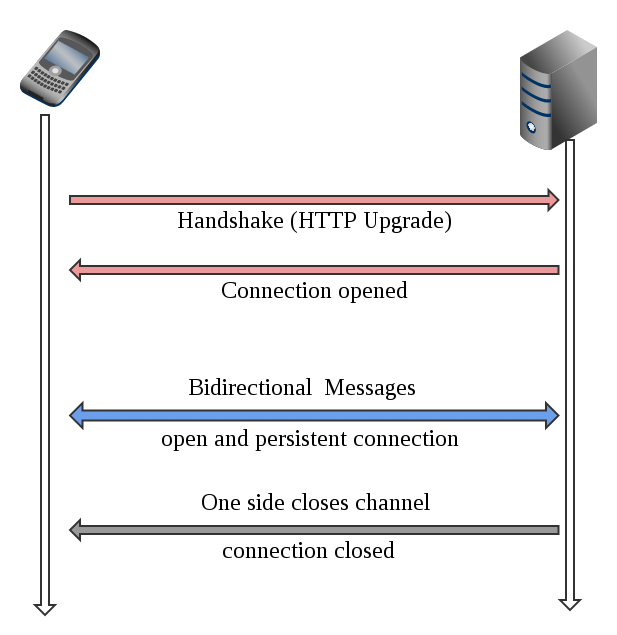

# Websocket

Websocket es un protocolo de comunicación basado en TCP (Protocolo de transporte orientado a la conexión) para poder establecer esa conexión entre el cliente y el servidor, justo como sabemos, es el mismo objetivo que cubre HTTP.

# ¿Qué hace que websocket se destaque?

A pesar de que websocket y HTTP son protocolos como lo mencionamos anteriormente, websocket tiene una característica muy importante: Su protocolo TCP establece dos endpoints de comunicación, a cada endpoint se le conoce como socket.

**El contar con estos dos sockets permitirá establecer una comunicación bidireccional entre el cliente y el servidor. La comunicación bidireccional implica:**
- Que el cliente puede obtener recursos del servidor cuando lo solicite (como en HTTP)
- Que el servidor pueda entregar información al cliente sin necesidad de que el cliente haga una petición.

#  El gran problema de las subastas en línea

Los negocios por internet son algo de lo más común, sin embargo, no toda la compra-venta de productos se da de la manera habitual del carrito de compra; algunos productos suelen ser sometidos a un proceso de subasta, donde los compradores deben realizar “pujas” constantes con el fin de ver quién ofrece la mayor cantidad de dinero.

Suena como un proceso común, pero computacionalmente hablando representa un asunto de cuidado: Actualizar información en tiempo real.

#  Planteamiento del problema

Sabemos ya que, según el protocolo bajo el cual hemos trabajado, el cliente debe hacer una petición de información al servidor, para que éste le responda con algo. 

Si el comprador 1 hace una puja. ¿Cómo podrá ver el estado de su puja? Tendría que actualizar la página, para que se haga nuevamente la petición al servidor con el estado actualizado. 

Ahora, si hay 100 compradores haciendo pujas constantemente. ¿Qué tan consistente será la información? ¿Qué tan eficiente es que tenga que estar refrescando la página cada vez que quiera ver el nuevo estado de la subasta?

#  Solución óptima: Websockets

### Websockets es un protocolo excelente para esta situación ya que:

- El cliente no tendrá que estar actualizando la página constantemente
- En cuanto el servidor reciba una actualización de una nueva puja, actualizará a todos los clientes conectados, permitiendo dar información en tiempo real
- Una vez que termina la subasta, el socket se cierra y el servidor deja de notificar innecesariamente al cliente.

#  Funcionamiento de un Websocket

### Primero, el cliente tiene que enviar una solicitud HTTP llamada Handshake (apretón de manos). Este apretón de manos será un “acuerdo” o “contrato” de confianza para que el servidor pueda actualizar al cliente sin que éste se lo pida. 

### El servidor recibe la petición de Handshake y procede a “responderle el saludo”, a esto se le llama “Abrir conexión”.

### A partir de este punto, el canal queda abierto de  manera bidireccional , por lo que el cliente se puede comunicar con el servidor cuando quiera y viceversa. 

### La comunicación es “persistente” hasta que alguno de los dos lados decida cerrar el canal de comunicación.

#  El protocolo Websocket: principios

- Websocket permitió por primera vez acceder a una web de forma dinámica en tiempo real.
- Basta con que el cliente establezca una conexión con el servidor, que se confirma mediante el llamado apretón de manos o Websocket Protocol Handshake.
- Con él, el cliente envía al servidor todos los datos de identificación necesarios para el intercambio de información.
- El canal de comunicación queda “abierto” tras el handshake.
- El servidor puede activarse por sí mismo y poner toda la información a disposición del cliente, sin que este tenga que pedírselo. Si dispone de nueva información, se lo comunica al cliente, sin necesidad de recibir una solicitud específica para ello.
- Las notificaciones push de las páginas web funcionan según este principio.

#  Ejemplos de uso de Websockets

- ###  Chats:  Ya sea en páginas de asistencia técnica, en redes sociales, o en algún juego, es necesario que el canal se dé en tiempo real
- ###   Paneles de “Noticias importantes” en sitios de noticias:  es importante que el usuario reciba las noticias más actuales, para así tener la primicia (que en estos tiempos es muy difícil por la rapidez de información).
- ###   Actualización de bolsa:  El tiempo real en transacciones en la bolsa de valores es crucial. Los usuarios no pueden perder tiempo mientras una página se recarga para poder ver los últimos cambios.
- ###   Juegos en tiempo real:  Cada movimiento, cada mensaje, cada ataque o cada acción de un jugador, debe verse reflejada para otros jugadores inmediatamente, por lo que las respuestas rápidas y en tiempo real son cruciales.
- ###   Plataformas compra/venta como Ebay:  Si tenemos contemplado algún sistema de subastas, donde el usuario necesite tomar acción rápida para la resolución de compra/venta de algún producto, entonces necesitamos respuestas inmediatas y visibles para todos.  

---
# Websocket: comparación con **HTTP**
 

|📻HTTP📻 | Websocket📞 |
| ----------- | ----------- |
| Son peticiones al servidor que esperan una respuesta. Como un walkie talkie. | Es un canal abierto entre servidor y cliente. Como una llamada telefónica. |
| Se solicita información y se espera una respuesta. Ej: un formulario de login | Se usa para comunicación en tiempo real. Ej: un chat |
| Se usa para consumir APIs y recursos web | Se usa para escuchar información en tiempo real |
| Conexión de una sola vía | Conexión de doble vía |
| No sustituye a WebSockets | No sustituye a HTTP |

#   ¡Importante!

### Como podrás notar, se menciona que HTTP no es reemplazo de Websocket, ni websocket es reemplazo de HTTP. Ambos son complementos que se pueden utilizar en conjunto, con el fin de hacer sistemas completos y complejos. 

# Sockets en Express con Socket.io

## Socket.io

- Es una librería de Javascript para poder implementar los sockets anteriormente mencionados.
- Debido al funcionamiento que hemos visto en clase. socket.io debe instanciarse tanto de lado del cliente, como del servidor.
- Permite utilizar todo el potencial mencionado de los websockets, y cuenta con una API casi idéntica para cliente y para servidor. 

## Caracteristicas:

- Socket.IO utiliza principalmente el protocolo Websocket proporcionando la misma interfaz.
- Se puede usar como un contenedor para Websocket aunque proporciona muchas más funciones, incluida la transmisión a múltiples sockets, el almacenamiento de datos asociados con cada cliente y E/S asíncronas.
- Se puede instalar con npm.
- **Fiabilidad:** Las conexiones se establecen incluso en presencia de:
1. proxies y balanceadores de carga.
2. firewall personal y software antivirus.
- **Soporte de reconexión automática:** A menos que se le indique lo contrario, un cliente desconectado intentará siempre volver a conectarse, hasta que el servidor vuelva a estar disponible.
- **Detección de desconexión:** Se implementa un mecanismo de heartbeat, lo que permite que tanto el servidor como el cliente sepan cuando el otro ya no responde.
- **Soporte binario:**  Se puede emitir cualquier estructura de datos serializable, que incluye:
1. ArrayBuffer y Blob en el navegador
2. ArrayBuffer y Buffer en Node.js

---

#   Instalación y configuración de Socket.io

### [Link a la  PPT ](https://docs.google.com/presentation/d/1n829vMvzAkiw3QiU37euy2E929Q5-229hmCvi5EPiYM/edit#slide=id.g1305406917f_0_581)

___

  

