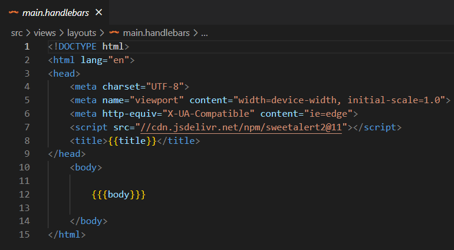
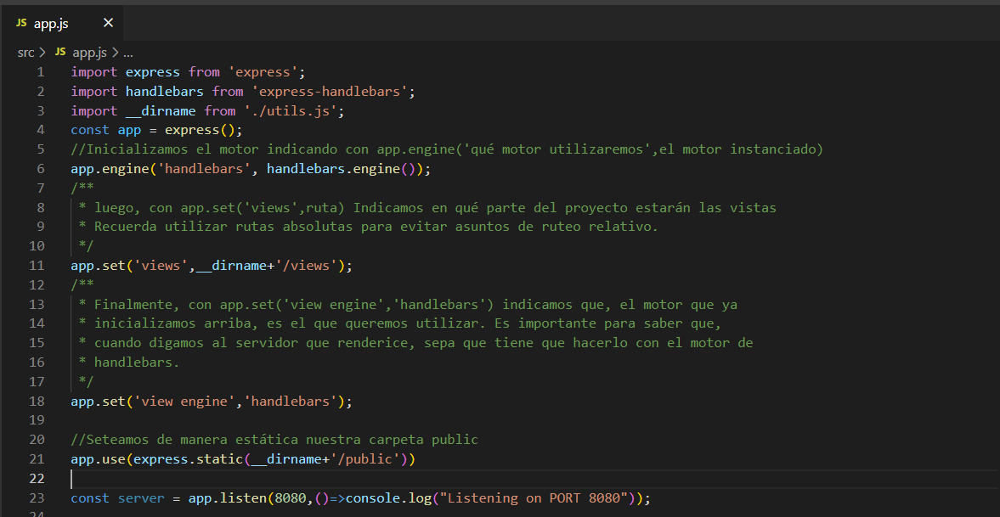
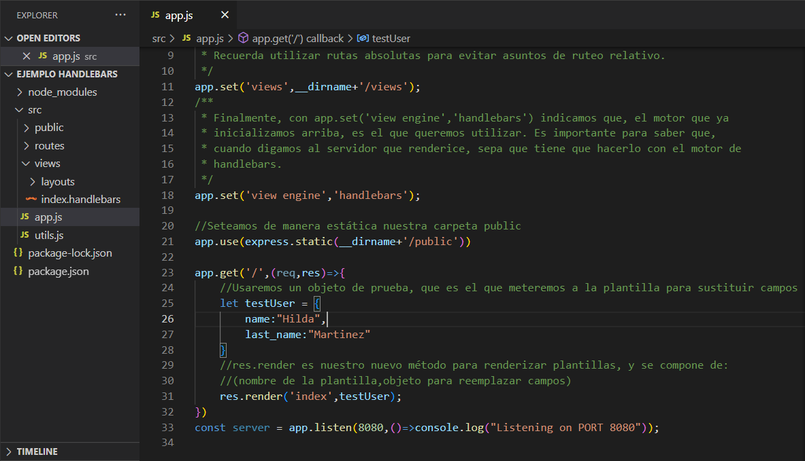
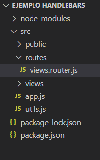
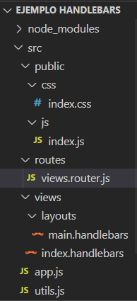

# <span style="color: Gold">MOTORES DE PLANTILLAS</span>

Un motor de plantillas es un componente de software que facilita la generación de contenido dinámico en aplicaciones web. Su función principal es combinar datos con plantillas predefinidas para producir documentos HTML, XML u otros formatos de salida. Estos motores permiten la creación de páginas web dinámicas al incorporar datos variables en la presentación.

# <span style="color: Snow">HANDLEBARS</span>

- Es un motor de plantillas pensado para agregar un **nivel medio** de dinamismo en una página web

- Dicho motor preprocesa el html que queremos renderizar, reconociendo el patrón {{variable}}, de manera que buscará un objeto que cuente con dicha propiedad para poder sustituir, dando el efecto de dinamismo.

- No está pensado para elementos de cambios constantes, esto debido a que los cambios siguen requiriendo una renderización completa del DOM.

## <span style="color: CornflowerBlue">Instalación y configuración de Handlebars en Express</span>

### - <span style="color: Tomato">Agregamos una carpeta Views</span>
### - <span style="color: Tomato">Tener listo tu proyecto express</span>


#### En esta carpeta agregaremos todas las plantillas que queramos utilizar, podemos entender entonces que aquí colocaremos las páginas a utilizar en el proyecto. 

#### Sin embargo, necesitamos un marco inicial para colocar las plantillas, para ello utilizaremos un “layout”. Crearemos una carpeta layouts dentro de views, y dentro colocaremos un “main.handlebars”, haciendo referencia a que ese es el marco principal. 

#### Luego, fuera de layouts,  pero dentro de views, agregaremos un index (página inicial)


### - <span style="color: Tomato">Configurar main.handlebars</span>



### - <span style="color: Tomato">Saludar desde index.handlebars</span>

```html
<div>
    Hola como estás? {{firstName}} {{lastName}}
</div>
```

#### *<span style="color: Goldenrod">Nota que es la estructura de un html cualquiera, sin embargo, esta vez dentro de body colocamos con {{{ }}} el nombre body (única vez que encerraremos en tres llaves).*

#### *<span style="color: Goldenrod">Ahora, cada vista de views que vayamos a renderizar, se renderizará dentro de este body. De esta manera, no tenemos que escribir una estructura html completa por cada vista que queramos trabajar.*

### - <span style="color: Tomato">Instalar el motor de handlebars</span>

```js
npm install express-handlebars
 ```
### - <span style="color: Tomato"> Configurando handlebars en nuestro motor express</span>



### - <span style="color: Tomato"> Creando método GET que renderiza la pantalla</span>




# <span style="color: LightPink"> IF, ELSE Y EACH</span>

### <span style="color: NavajoWhite"> Si bien las plantillas permiten “reemplazar” una marca por un dato dinámico, Handlebars nos proporciona también la capacidad para poder realizar estructuras de decisión o de repetición.

```html

  {{#if user.isAdmin}}
    {{#each food}}
      <div style='font-style: italic; background-color:blanchedalmond'>
        <p>Plato:{{this.name}}, Precio: {{this.price}}</p>

      </div>
    {{/each}}
  {{else}}
    <h1>No tenés acceso al menú</h1>
  {{/if}}

```
### <span style="color: NavajoWhite"> Es importante mencionar que el if no recibe expresiones, sino, variables equivalentes a un booleano. De este modo, debemos trabajar la logica en nuestra aplicacion!

```js
app.get('/', (req, res) => {
  
  const num = Math.floor(Math.random() * users.length);
  let user = users[num];
  const isAdmin = user.role === 'admin';
  user = { ...user, isAdmin }; // agregamos la propiedad isAdmin al user// Tambien es valido user.isAdmin = isAdmin
  res.render('index', { user, food }); //se manda como objeto, y en el index, se hace user.value porque si no no sabe a que objeto pertenece la variable
});
```

# <span style="color:gold"> Express Router + Handlebars

## <span style="color:PowderBlue"> Mover lógica de vistas a un router



- **Una forma de trabajar correctamente con plantillas, conforme crece nuestro sitio web, es colocar las vistas como si fueran un router más de nuestro servidor.**

- **La gran diferencia está en que los demás routers suelen responder con res.send. Mientras que el router de vistas siempre debe responder con res.render.**

- **Además, este router se colocará en la ruta raíz ‘/’ y no será necesario ser precedido por ‘/api’ como los demás.**

### <span style="color:gold"> A saber, lo unico que se hace, es pasar la logica de rederizado hacia el archivo views.routes, y por fuera de eso la configuracion es la misma de siempre:

```js
import { Router } from 'express';

const viewsRoutes = Router();

//Logica
//Logica
//Logica

export default viewsRoutes;
```
### <span style="color:gold"> En nuestro archivo app.js importamos el enrutador, siempre con la extension del archivo y luego definimos la ruta raiz para éste.

```js
import viewsRoutes from './routes/views.routes.js'; //acordarse del .js!!!!

//se define la ruta raiz para el enrutador
app.use('/', viewsRoutes);

```

**Nota que el router se encuentra en la ruta raíz, de manera que, cuando queramos hacer un llamado de un servicio más “lógico” que no requiera una vista, iniciaremos el router siempre con “/api/” Ya que las rutas sin api, corresponden a vistas a partir de ahora.**

# <span style="color: Snow"> Agregando js y css

## <span style="color: Snow"> Tu carpeta public aún sirve!



### A pesar de que ahora las páginas las tenemos en views. No significa que public deje de sernos útil. Recuerda que, al ser un servicio de archivos estáticos, nos puede servir para almacenar archivos de todo tipo a fácil acceso. 
### Eso quiere decir que también podemos guardar archivos de js y css con el fin de poder referenciarlos desde cualquier punto del servidor, en este caso, desde cada una de nuestras vistas. crearemos una carpeta css y una carpeta js para almacenar nuestros archivos. Todo lo que se quiera hacer desde el Frontend se puede hacer desde aquí.

### <span style="color: gold"> Archivo index.handlebars:

```html
<script src='js/index.js'></script>

```

### <span style="color: gold"> Archivo index.js

```js
console.log('Hola desde el FrontEnd')

```

# <span style="color: CornflowerBlue"> CSS

### Para aplicar estilos es un tanto mas complicado, veamos como se hace:

- **Se importa el css en el layout directamente, es decir en main.handlebars y la ruta se pasa dinamica:**
  
  ```html
    <link rel='stylesheet' href='css/{{style}}' />
  ```
- **Luego, en el archivo views.routes, pasamos como objeto la variable con el contenido, que en este caso va a hacer referencia al archivo index.css:**

```js
 res.render('index', { user, food, title: 'Usuarios', style: 'index.css' });
 ```